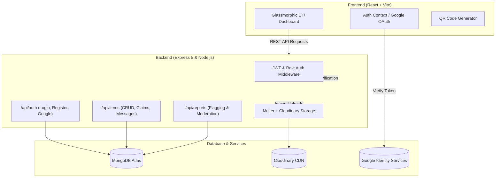

<<<<<<< HEAD
# 🎓 CampusCrate — Smart Campus Lost & Found System

<div align="center">

[](https://react.dev/)
[](https://vitejs.dev/)
[](https://nodejs.org/)
[](https://www.mongodb.com/)
[](https://cloudinary.com/)
[](LICENSE)

<p align="center">
  <b>A full-stack, secure, and modern MERN platform empowering university campuses to easily report, discover, verify, and return lost items.</b>
</p>

[Key Features](#-key-features) • [Tech Stack](#-tech-stack) • [Architecture](#-architecture) • [Project Structure](#-project-structure) • [API Endpoints](#-api-endpoints) • [Getting Started](#-getting-started) • [Environment Setup](#-environment-variables)

</div>

---

## 📖 Overview

**CampusCrate** is an intuitive, modern campus Lost & Found management platform designed for universities and colleges. Built on the MERN stack (MongoDB, Express, React, Node.js), it replaces disorganized WhatsApp groups, notice boards, and unorganized lost-and-found desks with a centralized, verified, and automated recovery system.

With features like **Google OAuth 2.0 authentication**, **ownership verification questions**, **QR code generation & sharing**, **Cloudinary image uploads**, **in-app item discussions**, and a **dedicated Admin moderation portal**, CampusCrate ensures that lost belongings are safely reunited with their rightful owners.

---

## ✨ Key Features

### 🔍 Discovery & Reporting
- **Instant Item Reporting**: Quickly report `Lost` or `Found` items with photos, title, description, category, location, date, tags, and colors.
- **Dynamic Search & Filtering**: Real-time searching with category filters (`Electronics`, `ID Cards & Wallets`, `Books & Stationery`, `Bottles & Flasks`, `Keys & Wallets`, `Clothing & Bags`, `Other`) and type toggling (`Lost` vs `Found`).
- **Cloud Image Uploads**: Seamless image upload handling powered by `multer` and `Cloudinary`.

### 🛡️ Claim Verification & Security
- **Ownership Verification Questions**: Item finders can specify confidential security questions that claimants must answer to prove ownership before retrieving the item.
- **Proof Uploads**: Claimants can submit proof images along with their claim requests.
- **Finder Response & Safe Drop Locations**: Finders can specify safe campus drop locations (e.g., Security Desk, Library Counter, Department Office).
- **Claim Workflow Management**: Transparent status transitions (`Pending` ➔ `Approved` ➔ `Rejected` ➔ `Returned`).

### 📱 Interactive Experience & Sharing
- **Dynamic QR Code Generation**: Generate and scan QR codes for any lost/found listing for quick mobile access and campus flyers.
- **Public & Authenticated Item Discussions**: Built-in messaging thread on each item's detail page for community coordination.
- **Responsive & Glassmorphic UI**: Sleek dark mode design built with **Framer Motion** animations and **Lucide React** icons.

### 👑 Comprehensive Admin Portal
- **User Management**: View all registered users, toggle user account blocks, or delete abusive accounts.
- **Item Moderation**: Manage active listings, inspect reported items, and remove non-compliant posts.
- **Claims & Exchange Logs**: Monitor verified claim histories and log completed item exchanges.
- **Report Resolution Workflow**: Handle flagged listings with status tracking (`Pending`, `Reviewed`, `Resolved`).

---

## 🛠️ Tech Stack

### Frontend
| Technology | Description |
| :--- | :--- |
| **React 19** | Modern component-based UI library |
| **Vite** | Next-generation fast frontend tooling and dev server |
| **React Router v7** | Declarative client-side routing & page transitions |
| **Framer Motion** | Micro-interactions, slide-ins, and smooth UI animations |
| **Lucide React** | Consistent, modern icon set |
| **QRCode.react** | Dynamic QR code rendering for item sharing |
| **@react-oauth/google** | Google OAuth 2.0 social sign-in integration |
| **Axios** | Promise-based HTTP client for REST API communication |
| **Oxlint** | High-performance linter for modern JavaScript |

### Backend
| Technology | Description |
| :--- | :--- |
| **Node.js** | Server runtime environment |
| **Express 5** | Scalable web application framework and REST APIs |
| **MongoDB & Mongoose** | Document database & schema modeling |
| **JWT (jsonwebtoken)** | Stateless token-based user authentication |
| **bcryptjs** | Password hashing and security |
| **Multer & Cloudinary** | Multipart form-data handling & cloud media storage |
| **Google Auth Library** | Server-side Google ID token verification |
| **CORS & Dotenv** | Cross-origin resource sharing and environment management |

---

## 📐 Architecture



---

## 📂 Project Structure

```text
mern-project/
├── backend/
│   ├── controllers/
│   │   ├── authController.js       # Auth logic (Register, Login, Google OAuth, User Admin)
│   │   ├── itemController.js       # Items, Claims, Exchanges, and Messages logic
│   │   └── reportController.js     # User item flagging and report moderation
│   ├── middleware/
│   │   ├── authMiddleware.js       # JWT protection & Admin authorization checks
│   │   └── uploadMiddleware.js     # Multer & Cloudinary storage configuration
│   ├── models/
│   │   ├── Claim.js                # Claim schema (item, claimant, drop location, proof)
│   │   ├── Exchange.js             # Exchange log schema (poster, claimant, status)
│   │   ├── Item.js                 # Lost/Found item schema (type, category, location, question)
│   │   ├── Message.js              # Item discussion message schema
│   │   ├── Report.js               # Flagged post report schema
│   │   └── User.js                 # User schema (roles: student, admin; blocked status)
│   ├── routes/
│   │   ├── authRoutes.js           # /api/auth routes
│   │   ├── itemRoutes.js           # /api/items routes
│   │   └── reportRoutes.js         # /api/reports routes
│   ├── .env.example                # Backend environment variable template
│   ├── package.json
│   └── server.js                   # Express server entry point & DB connection
│
├── frontend/
│   ├── public/                     # Static assets
│   ├── src/
│   │   ├── assets/                 # Images, SVGs, and brand assets
│   │   ├── components/
│   │   │   └── Navbar.jsx          # Responsive navigation bar with role-based links
│   │   ├── context/
│   │   │   └── AuthContext.jsx     # Global authentication state & user session
│   │   ├── pages/
│   │   │   ├── Admin.jsx           # Admin portal (Users, Claims, Reports, Exchanges)
│   │   │   ├── Dashboard.jsx       # User dashboard (My Posts, My Claims)
│   │   │   ├── Home.jsx            # Landing page with hero, search, and item grid
│   │   │   ├── ItemDetails.jsx     # Item view, QR code, claim submission, discussion
│   │   │   ├── Login.jsx           # User sign-in / registration & Google OAuth
│   │   │   └── PostItem.jsx        # Form for reporting lost or found items
│   │   ├── App.css                 # Component-specific styles
│   │   ├── App.jsx                 # Route definitions and layout
│   │   ├── index.css               # Global theme variables, glassmorphism, animations
│   │   └── main.jsx                # React DOM entry point
│   ├── .env.example                # Frontend environment variable template
│   ├── package.json
│   └── vite.config.js              # Vite configuration
│
└── README.md                       # Master project documentation
```

---

## 🔌 API Endpoints

### 🔐 Authentication (`/api/auth`)
| Method | Endpoint | Access | Description |
| :--- | :--- | :--- | :--- |
| `POST` | `/api/auth/register` | Public | Register a new user account |
| `POST` | `/api/auth/login` | Public | Authenticate user & issue JWT |
| `POST` | `/api/auth/google` | Public | Google OAuth 2.0 token sign-in/registration |
| `GET` | `/api/auth/me` | User | Get current authenticated user profile |
| `GET` | `/api/auth` | Admin | Retrieve all registered users |
| `PATCH` | `/api/auth/users/:id/block` | Admin | Toggle user block status |
| `DELETE` | `/api/auth/users/:id` | Admin | Delete a user account |

### 📦 Items & Claims (`/api/items`)
| Method | Endpoint | Access | Description |
| :--- | :--- | :--- | :--- |
| `GET` | `/api/items` | Public | Get all items with optional search & filters |
| `POST` | `/api/items` | User | Create a new lost/found item (with image upload) |
| `GET` | `/api/items/:id` | Public | Get single item details by ID |
| `DELETE` | `/api/items/:id` | User/Admin | Delete an item listing |
| `PATCH` | `/api/items/:id/status` | User | Update item status (`active`, `claimed`, `returned`) |
| `POST` | `/api/items/:id/claim` | User | Submit a claim / finder response for an item |
| `GET` | `/api/items/:id/claim` | User | Retrieve claims for a specific item |
| `PATCH` | `/api/items/claim/:claimId` | User | Approve or reject a claim request |
| `GET` | `/api/items/claims/all` | Admin | Retrieve all claims across all items |
| `GET` | `/api/items/exchanges` | Admin | Retrieve all completed exchange logs |
| `DELETE` | `/api/items/exchanges/:id` | Admin | Delete an exchange log record |
| `GET` | `/api/items/:id/messages` | Public | Retrieve public discussion messages for an item |
| `POST` | `/api/items/:id/messages` | User | Post a message to an item discussion thread |

### 🚩 Reports (`/api/reports`)
| Method | Endpoint | Access | Description |
| :--- | :--- | :--- | :--- |
| `POST` | `/api/reports` | User | Report an item listing for review |
| `GET` | `/api/reports` | Admin | Fetch all reported listings |
| `PATCH` | `/api/reports/:id/status` | Admin | Update report status (`pending`, `reviewed`, `resolved`) |
| `DELETE` | `/api/reports/:id` | Admin | Remove a report entry |

---

## ⚙️ Environment Variables

### Backend Configuration (`backend/.env`)
Create a `.env` file inside the `backend/` folder based on `.env.example`:

```env
# Port to run the Express server
PORT=5000

# MongoDB Connection String (Atlas URI or Local MongoDB)
MONGODB_URI=mongodb+srv://<username>:<password>@cluster0.mongodb.net/campuscrate?retryWrites=true&w=majority

# JWT secret key for signing auth tokens
JWT_SECRET=your_super_secret_jwt_key_here

# Cloudinary credentials for media storage
CLOUDINARY_CLOUD_NAME=your_cloudinary_cloud_name
CLOUDINARY_API_KEY=your_cloudinary_api_key
CLOUDINARY_API_SECRET=your_cloudinary_api_secret

# Google Client ID for server-side verification
GOOGLE_CLIENT_ID=your_google_client_id.apps.googleusercontent.com
```

### Frontend Configuration (`frontend/.env`)
Create a `.env` file inside the `frontend/` folder based on `.env.example`:

```env
# Backend API Base URL
VITE_API_URL=http://localhost:5000

# Google Client ID for OAuth Login component
VITE_GOOGLE_CLIENT_ID=your_google_client_id.apps.googleusercontent.com
```

---

## 🚀 Getting Started

### Prerequisites
Make sure you have the following installed on your system:
- **Node.js** (v18.0.0 or higher recommended) — [Download Node.js](https://nodejs.org/)
- **npm** (bundled with Node.js) or **yarn** / **pnpm**
- **MongoDB** (Local instance or [MongoDB Atlas Cloud Cluster](https://www.mongodb.com/atlas))
- **Cloudinary Account** (Free tier available at [Cloudinary](https://cloudinary.com/))
- **Google Cloud Console Project** (for Google OAuth Client ID)

---

### Step-by-Step Installation

#### 1. Clone the Repository
```bash
git clone https://github.com/pranavbellamkonda10089/mern-project.git
cd mern-project
```

#### 2. Backend Setup
```bash
# Navigate to the backend directory
cd backend

# Install dependencies
npm install

# Configure environment variables
cp .env.example .env
# Open .env and fill in your MongoDB, JWT, Cloudinary, and Google credentials

# Start backend server in development mode (with nodemon)
npm run dev
```
> The backend server will start on `http://localhost:5000` (or the port defined in `.env`).

---

#### 3. Frontend Setup
Open a new terminal tab/window:

```bash
# Navigate to the frontend directory
cd frontend

# Install dependencies
npm install

# Configure environment variables
cp .env.example .env
# Open .env and ensure VITE_API_URL and VITE_GOOGLE_CLIENT_ID are set

# Start frontend dev server
npm run dev
```
> The frontend application will run on `http://localhost:5173`.

---

## 🧪 Common Workflows

1. **User Sign Up & Login**:
   - Register with email & password or sign in seamlessly via Google OAuth.
2. **Posting a Lost / Found Item**:
   - Navigate to **"Report Lost"** or **"Report Found"**.
   - Fill in details, upload an image, and add a secret verification question.
3. **Claiming an Item**:
   - Locate the item on the Home dashboard.
   - Click **View Details** and submit a claim answering the verification question.
4. **QR Code Sharing**:
   - Click the **QR Code** button on any item card to display and share a scannable QR code for campus posters and flyers.
5. **Managing & Resolving**:
   - The finder reviews pending claims in their Dashboard.
   - Upon approving a claim and agreeing on a drop location, the item status updates to **Returned**.
6. **Admin Moderation**:
   - Admins can log in to access the `/admin` portal to monitor reports, moderate posts, and oversee all platform exchanges.

---

## 🔒 Security Best Practices
- **Password Encryption**: All user passwords are encrypted using `bcryptjs` with salt rounds before being stored.
- **JWT Authorization**: Sensitive REST API endpoints are protected using bearer token validation.
- **Role Verification**: Admin-only routes are gated by middleware enforcing role-based permissions (`student` vs `admin`).
- **Cloud-Safe Storage**: Images are processed directly through memory/cloud streams to Cloudinary, preventing unauthorized disk clutter.

---

## 📄 License
This project is open-source and licensed under the [ISC License](LICENSE).
=======
# React + Vite

This template provides a minimal setup to get React working in Vite with HMR and some Oxlint rules.

Currently, two official plugins are available:

- [@vitejs/plugin-react](https://github.com/vitejs/vite-plugin-react/blob/main/packages/plugin-react) uses [Oxc](https://oxc.rs)
- [@vitejs/plugin-react-swc](https://github.com/vitejs/vite-plugin-react/blob/main/packages/plugin-react-swc) uses [SWC](https://swc.rs/)

## React Compiler

The React Compiler is not enabled on this template because of its impact on dev & build performances. To add it, see [this documentation](https://react.dev/learn/react-compiler/installation).

## Expanding the Oxlint configuration

If you are developing a production application, we recommend using TypeScript with type-aware lint rules enabled. Check out the [TS template](https://github.com/vitejs/vite/tree/main/packages/create-vite/template-react-ts) for information on how to integrate TypeScript and Oxlint's TypeScript related rules in your project.
>>>>>>> 411c19243761925a0cdd6078308707c1cf635cf2
